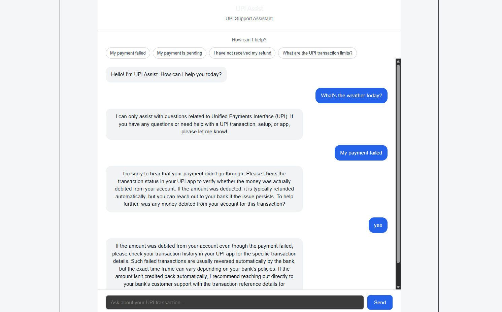

# UPI Assist

AI-powered UPI customer support assistant.

## Live Demo

### [UPI Assist](https://upi-ai-chatbot.vercel.app/) <-- Click this link for preview

The application is deployed using:
- **Frontend:** Vercel
- **Backend:** Render
- **AI:** Google Gemini

## Features
- Conversational AI
- Conversation context
- Intent classification
- Knowledge retrieval
- Grounded response generation
- Safety guardrails

## AI Architecture

React
 ↓
Node.js / Express
 ↓
Conversation History
 ↓
Gemini Intent Classification
 ↓
Knowledge Retrieval
 ↓
Intent Guidance
 ↓
Gemini Response Generation
 ↓
React

## AI Techniques

### Intent Detection
Gemini classifies queries into:
- PAYMENT_FAILED
- PAYMENT_PENDING
- REFUND
- UPI_LIMIT
- UPI_PIN
- SECURITY
- PAYMENT_NOT_RECEIVED
- GENERAL_UPI
- OTHER

### Retrieval
A lightweight retrieval system scores knowledge-base entries using:
- Intent match: +5
- Keyword match: +1

The top relevant results are supplied to Gemini.

### Grounding
Retrieved knowledge is provided to the LLM so responses are based on the application's predefined UPI information.

### Safety
The assistant is instructed not to request:
- UPI PIN
- OTP
- CVV
- Passwords
- Banking credentials

## Tech Stack

Frontend:
- React
- Vite

Backend:
- Node.js
- Express

AI:
- Google Gemini

Deployment:
- Vercel
- Render

## Running Locally

### Frontend
npm install
npm run dev

### Backend
npm install
npm start

Create `.env` with your Gemini API key.
